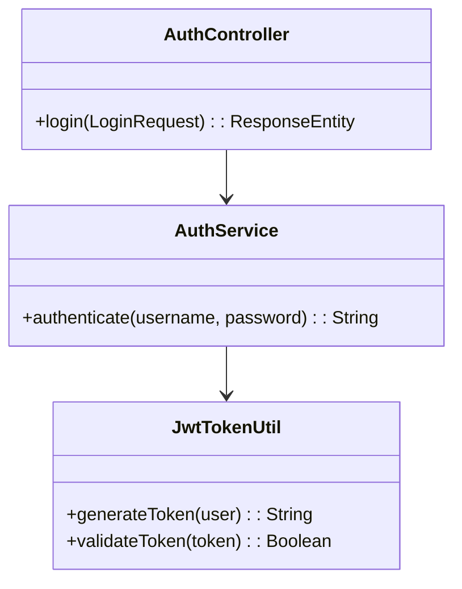

# 📦 auth-service

Este microservicio forma parte del sistema **PetCare** y se encarga exclusivamente de la autenticación de usuarios y veterinarios mediante el uso de tokens JWT.

## 📌 Funcionalidad principal

- Validación de credenciales de acceso (`username`, `password`).
- Generación de tokens JWT para autenticación en los demás microservicios del sistema.

## 🚀 Endpoint

| Método | Endpoint         | Descripción                                      |
|--------|------------------|--------------------------------------------------|
| POST   | `/api/auth/login` | Autenticación de usuario y generación de token  |

### 📝 Ejemplo de solicitud

```json
POST /api/auth/login
Content-Type: application/json

{
  "username": "usuario123",
  "password": "contraseñaSegura"
}

```

### 📝 Ejemplo de respuesta

```json
{
  "token": "eyJhbGciOiJIUzI1NiIsInR5cCI6IkpXVCJ9..."
}

```

  

## 🔐 Seguridad

Este servicio utiliza **JWT (JSON Web Tokens)** para la autenticación de usuarios y veterinarios.  
El token generado permite acceder a los endpoints protegidos de otros microservicios dentro del ecosistema **PetCare**.

- **Endpoint público:**  
  - `POST /api/auth/login`  
  - Este endpoint no requiere autenticación y devuelve un token JWT si las credenciales son válidas.

- **Autenticación en otros servicios:**  
  Todos los microservicios protegidos deben recibir el token en el encabezado `Authorization`:
  
```http
Authorization: Bearer <token>
```
---

## 🧱 Estructura y Diagrama de Clases

  

  


**📘 Diagrama Simplificado de Clases:**



  

## ⚙️ Configuración

Este microservicio utiliza configuraciones definidas en `application.properties`, y cuenta con un `Dockerfile` para facilitar su despliegue en entornos contenerizados.

### `application.properties`

Contiene las propiedades clave para la ejecución del microservicio y la gestión de tokens JWT.

```properties
server.port=8081

jwt.secret=my-super-secret-key
jwt.expiration=86400000

```
  

- `server.port`: Puerto en el que se ejecuta el microservicio `auth-service`.
- `jwt.secret`: Clave secreta utilizada para firmar los tokens JWT, asegurando su integridad.
- `jwt.expiration`: Tiempo de expiración del token en milisegundos (por ejemplo, 86400000 equivale a 24 horas).

---

### 🐳 `Dockerfile`

El `Dockerfile` permite empaquetar el microservicio en una imagen Docker lista para ejecutarse en cualquier entorno que soporte contenedores.

```dockerfile
FROM openjdk:17-jdk-slim
COPY target/auth-service.jar auth-service.jar
ENTRYPOINT ["java", "-jar", "auth-service.jar"]
```

 

#### Comandos para construir y correr el contenedor:

Para construir la imagen del microservicio `auth-service` con Docker:

```bash
docker build -t auth-service .
```

Luego, para ejecutar el contenedor:

```bash
docker run -p 8081:8081 auth-service
```

Esto levantará el servicio en: http://localhost:8081

### 🧪 Pruebas

El servicio **auth-service** incluye pruebas automatizadas para verificar su funcionamiento. Las pruebas están basadas en JUnit y se encuentran en la carpeta `src/test/java`.

  
  
  
  

### 🌐 Swagger

El servicio **auth-service** integra [Swagger](https://swagger.io/) para la documentación interactiva de la API. Con Swagger, puedes explorar todos los endpoints disponibles, visualizar sus descripciones y probarlos directamente desde el navegador.

Puedes acceder a la documentación de la API en la siguiente URL después de levantar el servicio:

```bash
http://localhost:8081/swagger-ui/index.html
```

### Endpoint de Login

- **URL:** `/api/petcare/auth/login`
- **Método:** `POST`
- **Descripción:** Este endpoint permite a los usuarios iniciar sesión en la plataforma. Recibe un `LoginRequest` con el nombre de usuario y la contraseña. Si las credenciales son correctas, se devuelve un token JWT para realizar futuras solicitudes. En caso contrario, se devuelve un mensaje de error.

#### Parámetros

- **Request Body:**

```json
{
    "username": "string",
    "password": "string"
}
```

#### Respuestas

- **Código 200 - Login exitoso:**
  
  Si las credenciales son correctas, se devuelve un JWT token para acceder a otros endpoints del sistema.

```json
{
    "token": "jwt-token-here"
}
```

#### Código 401 - Credenciales inválidas:

Si las credenciales proporcionadas (nombre de usuario o contraseña) son incorrectas, el servicio devuelve un mensaje de error.

```json
{
    "code": 401,
    "message": "Unauthorized",
    "details": "Invalid username or password"
}
```

### 📝 Ejemplo de Respuesta

#### Respuesta Exitosa (200)

Cuando el login es exitoso, el servicio devuelve un JWT token. Este token puede ser utilizado en solicitudes futuras para acceder a recursos protegidos.

```json
{
    "token": "jwt-token-here"
}
```

#### Respuesta de Error (401) - Credenciales inválidas

Si las credenciales proporcionadas no son correctas, el servicio devuelve un error con el código de estado 401 (No autorizado). Esto indica que las credenciales son inválidas.

```json
{
    "code": 401,
    "message": "Unauthorized",
    "details": "Invalid username or password"
}
```

#### Respuesta de Error (500) - Error Interno del Servidor

Si ocurre un error inesperado en el servidor, como problemas de conexión a la base de datos o errores de lógica interna, el servicio devolverá un código de estado 500 (Error Interno del Servidor). Esto indica que el servidor encontró una condición inesperada que le impidió cumplir con la solicitud.

```json
{
    "code": 500,
    "message": "Internal Server Error",
    "details": "Unexpected error occurred"
}
```
  

### 🧪 Test

#### Pruebas Unitarias

El servicio de autenticación incluye pruebas unitarias para verificar la correcta funcionalidad del endpoint de login y la generación de JWT tokens.

#### Herramientas de Test

Puedes usar herramientas como **Postman** o **Curl** para probar el endpoint de login y verificar el retorno de los JWT tokens o los errores en caso de credenciales incorrectas o problemas internos del servidor.

### 📬 Colección de Postman

Puedes utilizar esta colección para probar los endpoints del microservicio `auth-service`.

🔗 [Ver colección en Postman](https://github.com/jacito/pet-care/blob/425b6883b3da87d7577012c00df7a13f1253b361/PetCare.postman_collection.json)


### 🚀 Arranque del Servicio

Sigue los siguientes pasos para compilar y ejecutar el microservicio `auth-service`.

#### 1. Construcción del Proyecto

Utiliza Maven para compilar el proyecto:

```bash
mvn clean install
```
  

Este comando compilará el proyecto y generará el archivo .jar en la carpeta target/.

#### 1. Ejecución del Servicio

Puedes iniciar el servicio usando el siguiente comando:

```bash
mvn spring-boot:run
```

  


